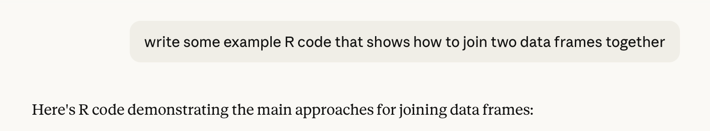
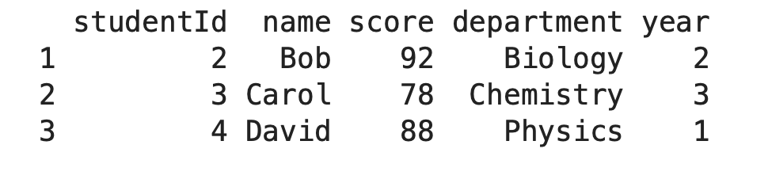

# GEOG 4/5/7 9073: Environmental Analysis in R

<div class="spacer-sm"></div>

## Week 01.01: Introduction

### Dr. Bitterman

<div class="spacer-sm"></div>

---

# Today's schedule

- Open discussion
- Course welcome
- Introductions
- R basics and practice

---

## Anything to discuss? Questions?

---

# My approach to this course

- Geography matters
- Concepts and independent thinking are important, trivia is not (or at least not always)
- It’s important to solve problems or complete tasks, but understanding HOW you do so is more important

---

# What this class is

- Collaborative
- Flexible
- **Student-led**

### What else it is
- A bit mis-named
- My second time teaching it at KSU... so we'll experiment a bit

---

# Class introductions

Pair up – and don’t leave anyone behind

Share:
- Name
- Where you’re from
- Major/program, year
- Why are you taking this course? Why are you in your major? Why KSU?
- Previous GIS/spatial analysis experience?
- Previous programming experience (or maybe experience with R)?
- Imagine it’s May 2026 – what would make you feel like you were successful in this course? (save this for later)


---

# My introduction

- Dr. Patrick Bitterman
- Independence, IA -> UIowa -> UVM -> UNL -> KSU
- Assistant Professor in Geography Department, 2nd/7th year
- Goals: teach a successful course, build my research program
- GIS experience? Programming experience? Extensive, but I don’t use ArcGIS much…
- Success in this course: 
  - students reach *their* learning objectives
  - students are able to use R to make their work faster and more consistent
  - students improve methods related to their other research or career interests
  - students develop an appreciation for programmatic spatial analysis

---

# Time to share

- Present your partner to the class
- Who wants to go first?

**Share:**
- Name
- Where you’re from
- Major/program, year
- Why are you taking this course? Why are you in your major? Why KSU?
- Previous experience: GIS, programming, R?
- IWhat would make you feel like you were successful in this course?

---

# Course basics

---

# Instructor (me)

- Dr. Patrick Bitterman
- Geography Department

- Office: 436 McGilvrey Hall
- Office hours: MW 9-11am, or by appointment
- Email: pbitterm@kent.edu


---

# Materials

- Brunsdon, C., Comber, L. 2025. An Introduction to R for Spatial Analysis and Mapping (Spatial Analytics and GIS). 3rd Edition. SAGE. [Link](https://collegepublishing.sagepub.com/products/an-introduction-to-r-for-spatial-analysis-and-mapping-3-288946)

- Optional: Wickham, H. 2017. R for Data Science: Import, Tidy, Transform, Visualize, and Model Data. O’Reilly Media. (if you are unfamiliar with R or other programming language) [Link](https://r4ds.had.co.nz/index.html)

---

# Learning objectives

By the end of the term, students will be able to successfully:

- Demonstrate a familiarity with the R programming language in the context of geospatial analysis
- Write self-contained functions to automate geospatial tasks
- Analyze model workflows and describe computer code and algorithms in plain language
- Create small-scale programs that interface with web-based tools
- Practice good programming practices
- Plan, develop, and execute a programmatic analysis of a dataset

---

# Course policies

Assignment submission:
- All assignments due on their due date
- All assignments will be posted on Canvas, but turned in via GitHub (we'll talk more)
- Late items will be accepted, but will be penalized 20% of the potential points for each day they are late
- All changes to the syllabus will be communicated via Canvas announcement
- Students are expected to attend all class meetings, but attendance is not graded


---

# Collaboration

- Feel free to discuss labs, etc. with your classmates
- However…
  - All lab reports, papers, and other work should be your own, individual thoughts
  - Students who do not follow these policies will be reported to the College for academic dishonesty


---

# Other tips

- Read relevant materials before class
- Attend class – understanding theory and concepts will help you with practical applications
- If there are topics, news stories, blog posts, tweets, etc. that you find interesting or want to know more about, let me know
- Before you start coding, think through the process and sketch out the workflow. This is called *pseudocode*
- Labs build on each other, so don’t get behind
- Take advantage of office hours
- Do not leave assignments until the last minute
- Have fun!

---

# Assessment

- Lab assignments
- 6 labs, 2-3 weeks to complete each one
- Final project
  - Proposal
  - Update presentation (in-class)
  - Final presentation (in-class)
  - Final report
- Participation

---

# Graduate students

For graduate students, the requirements of the final project will be expanded to include: 

1) an additional 3-4 pages in your report
2) code documentation
3) an additional 5 minutes in your final presentation to the class. 
4) required to produce a cover page for your GitHub page/portfolio

---

# Course format

- Project-based
- Student-led
  - I am not going to recap the readings (much)
  - You are expected to be ready to participate in discussion
  - We will spend most of our time doing, not lecturing

- **Tuesdays:** discussion, examples, and activities
- **Thursdays:** wildcard day (coding challenges, group work, seminar)

---

# Course inspiration and source material

- My own experience
- Your textbook
- Lovelace, R. *Geocomputation with R* https://geocompr.robinlovelace.net/index.html

---

# University policies

- Learning accommodations
  - Contact Student Support Services 
  - Let me know
- Academic integrity
  - Don’t cheat
  - Don’t plagiarize 
- Health and safety
  - Student support services (https://www.kent.edu/studentsupportservices)

---
## The Generative AI Elephant in the Room

-   Yes, ChatGPT, Claude, Copilot, etc. can write code...

-   ...and most of the time, it's even correct

# For example



---

```r
library(tidyverse)
# Create example data frames
df1 <- data.frame(
  studentId = c(1, 2, 3, 4),
  name = c("Alice", "Bob", "Carol", "David"),
  score = c(85, 92, 78, 88)
)

df2 <- data.frame(
  studentId = c(2, 3, 4, 5),
  department = c("Biology", "Chemistry", "Physics", "Math"),
  year = c(2, 3, 1, 4)
)

inner_join(df1, df2, by = "studentId")
```
---

# It even worked



---

## The AI "discussion"

In your opinion AND in the context of this class...
- What are some arguments FOR using GAI for writing code?
- What are some arguments AGAINST using GAI for writing code?
- What is a reasonable use policy?

---


# Anything else?

- Questions?

##

- Let's look at the Canvas and GitHub sites

---


# Let's talk coding

---


# SA and Programming in R

- Experience? In what setting?
- Experience with a version control system (e.g., git)?
- What about experience with spatial analysis, GIS?


---
# Let's make sure we're setup and familiar with R + RStudio

1. Login to your computer if you haven't (you may also use your own)

2. Launch RStudio

3. Wait

---

# R and RStudio: Understanding the Relationship 

R and RStudio are **complementary but distinct tools** that work together for data analysis:

### **R**

- underlying statistical programming language and computational engine
- performs all calculations, executes code, manages data structures, and produces outputs
- can run independently from the command line or terminal

---

# **RStudio**

- is an Integrated Development Environment (IDE)

- sends your code to R for execution and displays the results in an organized workspace

- means you could use R with different interfaces (VSCode, Jupyter, command line), but...

- RStudio is purpose-built for R workflows and offers features specifically designed for statistical analysis and data science tasks

---

# The RStudio Interface

When you first launch RStudio, you'll see a workspace divided into four main panes (which you can customize):

### 1. Source Pane (Top Left)

This is your code editor where you write and save R scripts (.R files) or Quarto/R Markdown documents (.qmd/.Rmd files).

- Write multi-line code that you can save and reuse
- Execute single lines with `Ctrl+Enter` (Windows/Linux) or `Cmd+Enter` (Mac)
- Execute selected code chunks
- Syntax highlighting helps identify functions, variables, and errors
- Line numbers assist with debugging

***Always (mostly) work in scripts rather than only in the Console—this ensures reproducibility***

---

# 2. Console Pane (Bottom Left)

This is where R actually runs and displays output.

- Code executed from the Source pane appears here
- You can type code directly for quick tests or calculations
- Results, messages, warnings, and errors display here
- The `>` prompt indicates R is ready for input
- The `+` prompt means R is waiting for you to complete a command

---

# 3. Environment/History Pane (Top Right)

**Environment tab:**

- Shows all objects currently loaded in your R session (e.g., data frames, vectors, functions)
- Click on data frames to view them in a spreadsheet-like format
- Displays object types and dimensions
- The broom icon clears your workspace (be careful!)

**History tab:**

- Records all commands you've executed
- Useful for recovering code you ran but didn't save

---

# 4. Files/Plots/Packages/Help Pane (Bottom Right)

multi-purpose pane with tabs:
- **Files**
- **Plots**
- **Packages**
- **Help**
- **Viewer**

---

# Let's try it out

Practice using RStudio by:

1.  Creating a new R Script (File \> New File \> R Script)
2.  Writing simple code (e.g., `x <- 1:10`)
3.  Executing it and observing results in the Console
4.  Viewing created objects in the Environment pane
5.  Creating a simple plot and viewing it in the Plots pane

---

```r
x <- 1:10
x
x * 2

```

---

```r
y <- rnorm(100, mean = 0, sd = 2)
hist(y)

```

---

```r
x <- 1:100
y <- rnorm(100, mean = 0, sd = 2)
plot(x, y)

```
---

# Review and next class

- Any questions on course policies?
- On anything else?

### **This week's readings/tasks:**

1.  Complete the setup steps in the ["getting up to speed"](https://kent.instructure.com/courses/130095/pages/week-1-getting-up-to-speed?module_item_id=6248267) page
2.  Review chapters 1 - 4 on the *R for Data Science* page I linked above. Don't worry, it'll go more quickly than it sounds.
3.  Practice on your own
4.  Come to ***NEXT*** class with [***at least 2 questions***]{.underline} you have about R, geospatial programming in general, or this course.

### Next session: basics of R and GIScience
