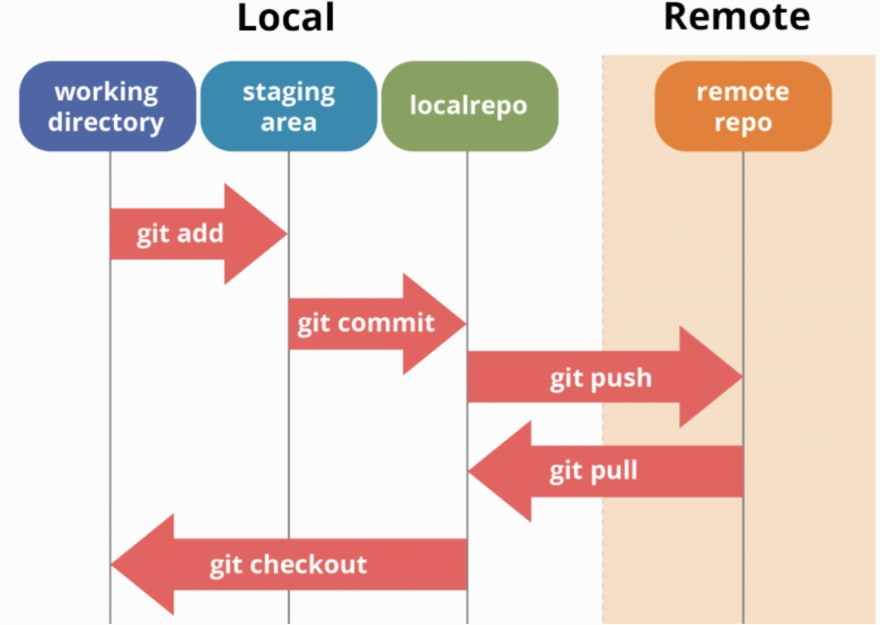

# GEOG 4/5/7 9073: Environmental Analysis in R

## 

## Week 03.01: a quick introduction to git/GitHub and spatial data manipulation

### Dr. Bitterman

## 

---

# Today's schedule

- Open discussion
- git and GitHub
- Spatial data 101

---

## Anything to discuss? Questions?

---

# What is git and what is GitHub?

* a version control system
  * a place to store your code/data
  * a place to keep your code history
  * a place to communicate in public/private
  * a place to track/fix issues

* ...and much, much more

---

# the "repository" (or informally, "repo")

- the "remote" repository exists on GitHub servers
- the "local" repository exists on your machine 
- and you communicate between the two

---

# The communication model




---

# Fundamentally:

- git-commit: commit your changes locally
- git-push: push your committed changes FROM local, TO remote
- git-pull: pull the cloud version FROM remote, TO local

---

# How you'll start the process:

1. from your GitHub account, **create** a new repo
2. from your local machine, use GitHub desktop (or other software) to first **clone** the repo locally, then
3. **pull** the repo for the first time
4. make a change (like a new RStudio project, add some data, whatever)
5. **commit** the change locally
6. then **push** to the remote (on GitHub servers) 

that's it!

---

# So when do you git-pull?

---

# How will we use github in this course?

- it's where I'm hosting our material
- but you'll also make your own PUBLIC repository for labs (all can be in the same repo)
- and I'll use it to grade

---

# Questions???
## (I know it's a confusing topic)

---

# A quick intro to spatial data

### Today's packages
```r
library(tidyverse)
library(sf)
```

### New data in the course repo:
`./data/CBW/County_Boundaries.shp`
`./data/Non-Tidal_Water_Quality_Monitoring_Stations_in_the_Chesapeake_Bay.shp`

### start a new project/script in R

---

# Reading a shapefile is straightforward with *sf*

### Look at it first
```r
library(tidyverse)
library(sf)

p.counties <- "./data/CBW/County_Boundaries.shp"
p.stations <- "./data/CBW/Non-Tidal_Water_Quality_Monitoring_Stations_in_the_Chesapeake_Bay.shp"

d.counties <- sf::read_sf(p.counties)
d.stations <- sf::read_sf(p.stations)
```
### What are we left with?

---

# What are our initial steps?

* ESDA!
  * Investigate the objects
  * **glimpse()**
  * **plot()** <-- do NOT do this yet... you'll see why
  * But you can look at it in ArcGIS Pro or QGIS


---

# A quick look at the data

```r
glimpse(d.counties)
glimpse(d.stations)
```

### Essentially a data.frame with a `geometry` attribute

- All the dplyr verbs (e.g., `select`, `filter`, `mutate`) work

### So let's subset... which function would we use do that?

---

# Let's get the counties in Delaware

### Let's break it down

```r
del.counties <- d.counties %>% dplyr::filter(STATEFP10 == 10)
```

---

# A spatial problem... how do we find the stations in Delaware?

### Anything we need to take into consideration prior to doing the work?

---

# Projections 101

### Our data are spatial data, so we can investigate their spatial characteristics

```r
d.counties %>% sf::st_crs()
d.stations %>% sf::st_crs()
```

### they're the same in this case, but we can formally test
```r
d.counties %>% sf::st_crs() == d.stations %>% sf::st_crs()
```
---

# A detour into coordinate reference systems
## (or "CRS")

### A CRS has 3 key elements... any ideas?

1. 

2. 

3. 

---

# Finding the stations in Delaware

### Let's break it down
```r
de.stations <- sf::st_intersection(d.stations, del.counties) # might take a bit
glimpse(de.stations)
plot(de.stations)
```
### What was the output?

---

# One last question

- does order matter?
- are these equivalent?
```r
option_1 <- sf::st_intersection(d.stations, del.counties)
option_2 <- sf::st_intersection(del.counties, d.stations)
```
# Yes or no?

---

# Your tasks:

- Explore other `sf` functions (e.g., `st_area`)
- try some of what's in your book
- we'll worry about projections and mapping later

---

# Review and next class

- Any questions?

- This week’s readings/tasks: 
  - Chapter 3 in textbook
  - Watch video posted to Canvas (https://www.youtube.com/watch?v=iv8rSLsi1xo)
  - Practice, practice, practice

- Lab 01 starts Thursday!


