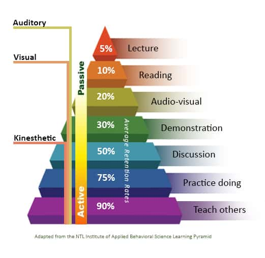

# GEOG 4/5/7 9073: Environmental Analysis in R

## 

## Week 7.02: Geometry, data structures, and the flipped classroom

### Dr. Bitterman

## 

---

# Today's schedule

- Open discussion
- Something different - you get to choose
- For next class

---

## Anything to discuss? Questions?


---

# Today's options

## Required
1. Code reading exercise

## As a class, let's pick one of the following:
2. The tasks from 4.02
3. Chapter 5 "lessons"


### Let's talk about the options
---

# How do we (and you) learn best? Thoughts?

---



(to be fair, there are counterarguments to this model)

---

# This week's activity

- You all read (or should have) Chapter 5 from Lovelace (https://geocompr.robinlovelace.net/geometric-operations.html)

- Instead of me providing you with a step-by-step walkthrough of the readings, **you're** going to do the teaching

- A quasi-"flipped classroom"


---

# What to do

- Form small groups (I've assigned the groups)
- Each group will be assigned a topic (or topics) from this week's readings
- Your tasks:
  - Develop a short (~10 min) lesson demonstrating the method(s)
  - Include:
    1. Learning objectives (what students will learn)
    2. Why the concepts/methods are important/relevant
    3. How a student would accomplish the task(s)
    4. A way to check for learning (and teaching != learning)

### All relevant resources can be found in the Lovelace chapter, but use what you think is relevant


---

# What you can use

- Anything
  - Web resources
  - Sample data
  - Whatever format you want (e.g., PowerPoint, R Markdown, something else)

---

# Tasks and teams

### Creating geometry, binary transformations, type transformations
- NAMES

### Simplify, scale, shift, and rotate geometry
- NAMES

### Raster aggregation, disaggregation, and resampling
- NAMES

---

# Choice?

---

# Required code reading activity

---

# It's important that our code be readable, reproducible

- In group/collaborative settings, you'll have to read the code of others
- So today, you'll read some of MY code
- And interpret it

---

# About the code

- It contains functions AND procedural code that uses those functions
- It WAS a bit old, but I have updated it to reflect new packages and paradigms
- It relies on data that I have added to `/data/erie_cicyano/`

---

# About the GitHub repository

- Let's talk strategies
- Clone vs. fork vs. downloading the repo vs. downloading only what you need

---

# Your task

- In the ```/src/``` directory of the course repo, find the ```code_reading_ex.R``` file
- I've stripped most of the comments from the document
- Your tasks...
    1. look at the code (and comments) to understand the "flow" of the code
    2. then, go through the code, line-by-line
    3. think about what the code is doing, then test it
    4. fill in the comments (behind the "#") with what the code does

- You can run it at any time up to any step
- I'm assigning teams

---

# Questions?

---

## For next week

1. Proposals due MONDAY
2. Next week is spatial autocorrelation


